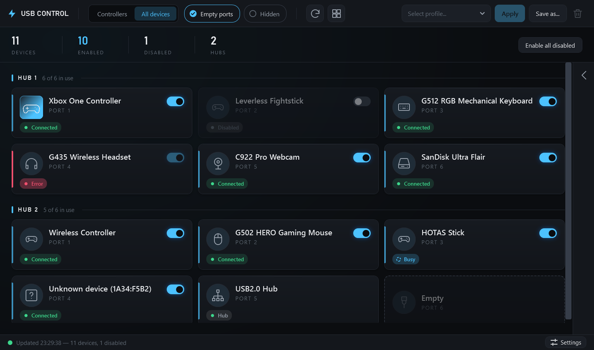
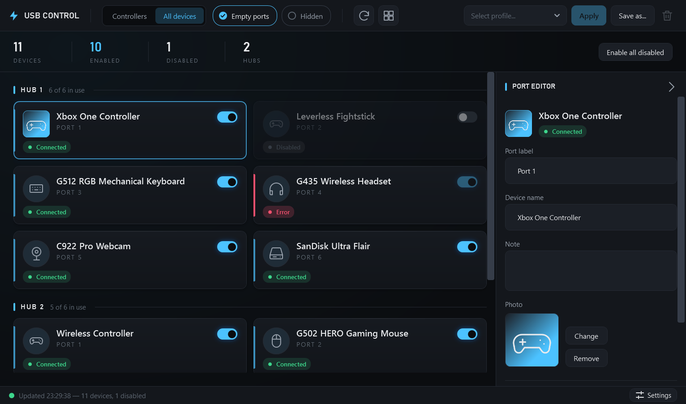
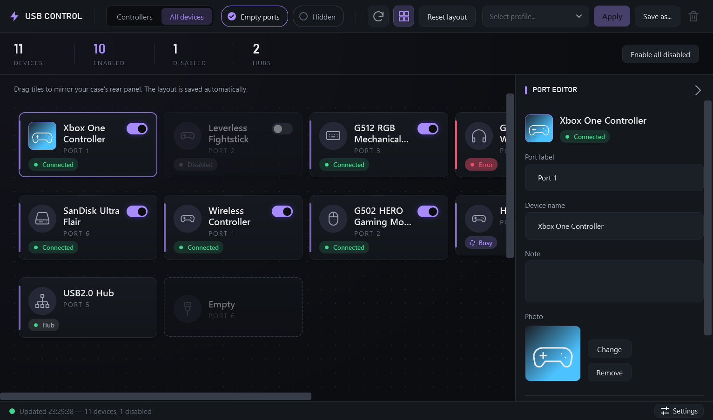

# USB Control

A visual USB port manager for Windows, built for people with a drawer full of controllers.
Every physical USB port on your PC becomes a labeled tile you can rename, describe with a note
and a photo, and switch on or off with one click, without reaching behind the case or
unplugging anything.

> **Status: beta (v0.1).** It works against simulated hardware and in automated tests, but has
> had limited testing on real machines. It is unsigned and must run as administrator. Please read
> [What this does to your PC and how to undo it](#what-this-does-to-your-pc-and-how-to-undo-it)
> before you use it.



*Screenshots show the built-in `--demo` mode (a simulated set of devices), not a real PC.*

## Who it's for, and why it beats unplugging

For anyone with more USB devices than they want plugged in at once: controller collectors,
sim-racing and flight-sim rigs (HOTAS, pedals, wheels), arcade and fightstick setups.

- **No more replugging.** Physically swapping cables wears out connectors, and the ports you
  actually use are the ones hardest to reach behind the case.
- **Leave devices plugged in but off.** A flight stick, a leverless controller or a second pad can
  stay connected and simply be disabled until you want them.
- **Better than Device Manager.** Device Manager shows generic names, no port map and no
  pictures. This shows every port as a tile with your own names, notes and photos.
- **Profiles.** Save "Flight sim" or "Co-op, 4 pads" once and apply it in one click.

## Features

- **Live port map.** Walks the real USB tree (controllers → root hubs → downstream hubs → ports)
  using the same user-mode hub IOCTLs as Microsoft's USBView sample. Every physical port is a
  tile, grouped by hub, refreshed automatically when devices arrive or leave.
- **One-click enable / disable.** Uses CfgMgr32 (`CM_Enable_DevNode` / `CM_Disable_DevNode` with
  `CM_DISABLE_PERSISTENT`), the mechanism Device Manager uses, so a disabled device stays disabled
  across reboots and replugs until you re-enable it.
- **Clear device states.** Connected, disabled (dimmed and desaturated), error (red edge, with a
  tooltip explaining the port's failure, such as not enough power or over-current), busy, hub and
  empty ports, each with its own look. A summary band counts devices, enabled, disabled and hubs.
- **Names, notes, photos.** Rename any device and any port, attach a picture. Metadata is keyed by
  VID/PID + serial, so your labels re-attach when the device comes back, even on another port.
- **Profiles.** Capture the current on/off state, then apply it later: profile devices are
  enabled in profile order (250 ms apart), everything else is disabled.
- **Lockout protection.** Disabling a keyboard or mouse asks first, with a louder warning when it
  is your last enabled one. **Enable all disabled** is always one click away, and if the app is
  interrupted while applying a profile it offers to undo it on the next start.
- **Scope and filters.** *Controllers* (hubs and HID/game devices) or *All devices*, plus
  *Empty ports* and *Hidden* toggles, and per-port hiding.
- **Panel layout.** A free-form canvas: drag tiles to mirror the back of your case, with grid
  snapping. Positions persist per port.
- **System tray.** Minimize or close to the tray with a live status tooltip and one-click profile
  switching from the tray menu. On Windows 11 new tray icons start in the overflow flyout; drag it
  onto the taskbar to pin it.
- **Look and feel.** Dark UI with five switchable accent palettes (Cyan, Violet, Toxic, Blood,
  Amber), a collapsible port editor, and motion tuned to stay out of the way.

| Port editor | Panel layout (Violet accent) |
| --- | --- |
|  |  |

### About controller order

Applying a profile enables its devices one at a time, in profile order. Some people use this to
influence which controller becomes Player 1, but **that is unverified**: Windows and individual
games may assign player slots differently, and this has not been tested on real controllers.
Treat it as a possible side effect, not a feature to rely on.

## What this does to your PC and how to undo it

**What it does.** USB Control disables and enables devices through the same Windows API that
Device Manager's *Disable device* uses. A disabled device:

- stays disabled after a reboot and after you unplug and replug it,
- stays disabled even if USB Control is closed or uninstalled.

The app has to run as administrator to do this (you get a UAC prompt). It installs no drivers or
services. It stores its data in `%APPDATA%\USBControl\` (`store.json`, `Photos\`, and a `crash.log`
if something goes wrong). If you turn on *Start with Windows* in Settings, it adds one entry under
`HKCU\Software\Microsoft\Windows\CurrentVersion\Run`. Turning that option off removes it.

**Built-in safety nets.** Disabling a keyboard or mouse needs confirmation; **Enable all
disabled** (top right, shown whenever something is disabled) re-enables every disabled device.

**Undoing it without the app.** Use whichever is easiest:

1. **Device Manager.** Press <kbd>Win</kbd>+<kbd>X</kbd> → *Device Manager*. Disabled devices have
   a small down-arrow icon. Right-click one → *Enable device*. (If nothing shows, use
   *View → Show hidden devices*.)
2. **PowerShell, as administrator**, to enable every currently disabled device:

   ```powershell
   Get-PnpDevice -PresentOnly | Where-Object Problem -eq 'CM_PROB_DISABLED' | Enable-PnpDevice -Confirm:$false
   ```

   Or one device at a time, using its instance ID (shown in USB Control's editor under *Details*,
   or in Device Manager):

   ```powershell
   pnputil /enable-device "USB\VID_045E&PID_0B12\XBOXSERIAL1"
   ```

**If you disabled your only keyboard or mouse.** Plug in any other keyboard or mouse (a different
device works even if the disabled one stays off), or use the on-screen keyboard from the
<kbd>Win</kbd>+<kbd>Ctrl</kbd>+<kbd>O</kbd> shortcut or the sign-in screen's *Ease of access* button, then run the
PowerShell command above. Safe mode does **not** undo a persistent disable.

**Uninstalling.** Exit from the tray menu, run the undo step first (disables persist), then delete
`USBControl.exe` and `%APPDATA%\USBControl\`.

**Known limitations of this beta**

- Unsigned, so Windows SmartScreen shows "Windows protected your PC" (choose *More info → Run
  anyway*), and some antivirus products may flag a large unsigned admin program. You can compare
  the file's SHA-256 with the value on the release page.
- Anti-cheat software may object to a tool that toggles devices while a game is running.
- Windows Update or a driver reinstall can re-enable a device you disabled.
- Tested mainly against a simulated USB bus, with limited testing on real hardware; other
  controller, hub and Bluetooth combinations may behave differently. Please report problems.

## Download and run

Get `USBControl.exe` from the [latest release](https://github.com/tuskilicious/USBControl/releases/latest). Two builds are offered:

| File | Size | Needs |
| --- | --- | --- |
| `…-win-x64.exe` | about 75 MB | nothing else (self-contained) |
| `…-win-x64-framework-dependent.exe` | about 25 MB | the [.NET 8 Desktop Runtime](https://dotnet.microsoft.com/download/dotnet/8.0) (x64) |

Command line: `USBControl.exe --minimized` starts hidden in the tray (used by *Start with
Windows*). `--demo` runs a simulated set of devices with no hardware access and no elevation; it
needs `USBControl.Testing.dll` next to the exe, which a source build produces.

## Building

Requires the .NET 8 SDK (a user-local install works fine):

```bash
dotnet build USBControl.sln
dotnet test tests/USBControl.Tests/USBControl.Tests.csproj
dotnet publish src/USBControl.App/USBControl.App.csproj -c Release -r win-x64 \
  --self-contained true -p:PublishSingleFile=true -p:IncludeNativeLibrariesForSelfExtract=true -o publish
```

A GitHub Actions workflow builds, tests, publishes the exe and runs it in `--demo` on a clean
Windows VM for every push (it has no real USB devices).

## Testing without hardware

`USBControl.Testing` is a fake-hub harness that simulates a USB bus so the enumeration → merge →
identity-matching → profile pipeline can be integration-tested with no hardware plugged in:

- **`FakeUsbBus`**: named hubs with numbered ports; plug/unplug/move devices (Windows-format
  instance ids: serial devices keep their identity across ports, serial-less ones get fresh
  location tails, like the real bus); Device-Manager-style **persistent disable** that survives
  unplug/replug and a simulated `Reboot()`.
- **`FakeTopologyService` / `FakeDevicePowerService`**: `ITopologyService`/`IDevicePowerService`
  implementations over the bus, with a full call log and per-device failure injection
  ("devnode busy") for error-path tests.
- **`TestingRig`**: one object wiring bus + fakes + a temp-dir store + the **real**
  `AppController`, so tests drive the actual application code including hot-plug refreshes.

The integration suite covers identity re-attachment after replug, disable persistence across
unplug/replug/reboot, ordered profile enables, partial-failure reporting, hot-plug refreshes, the
keyboard/mouse lockout prompt (accept and decline) and the *Enable all disabled* escape hatch.

```bash
dotnet test tests/USBControl.Tests/USBControl.Tests.csproj
```

What the fake bus cannot tell you is how real hardware behaves (composite devices, devices that
refuse to disable, re-enumeration). That still needs testing on physical machines.

## How it works (the short version)

- `USBControl.Hardware` enumerates hub interfaces, opens them, and asks every port for its
  connection info (`IOCTL_USB_GET_NODE_CONNECTION_INFORMATION_EX`), instance id
  (`IOCTL_USB_GET_NODE_CONNECTION_DRIVERKEY_NAME`) and product string. Each port's device is
  correlated to its PnP devnode and enriched with friendly name, class and children, including the
  XINPUT child that carries the name you actually recognize.
- Device changes arrive via a background message-only window receiving `WM_DEVICECHANGE`
  (debounced), so the map stays live without polling.
- `USBControl.Core` holds the models, the identity/matching logic (re-attaching your names to
  replugged devices), the JSON store, and the profile engine.
- `USBControl.App` is the WPF UI: theme tokens, port tiles, editor panel, profiles, settings.

## Roadmap ideas

- Validate on real hardware across more machines, and decide whether controller order is real.
- Webcam snapshot as the device photo
- Storage devices support with safe-eject-style actions
- Auto-apply a profile when a game starts, and global hotkeys (deliberately deferred until the
  toggle path has been proven on real hardware)
